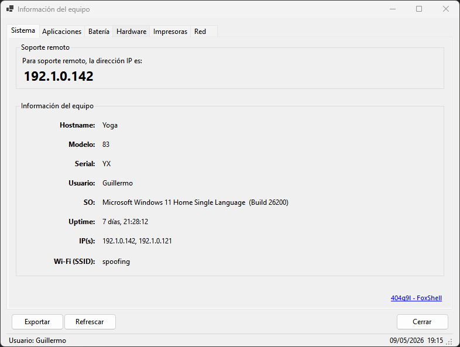
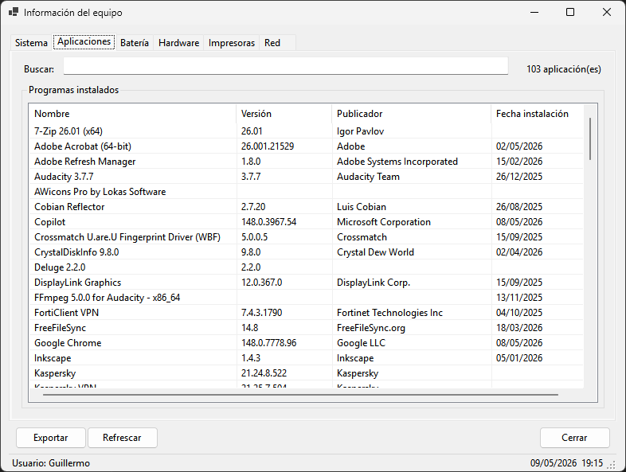
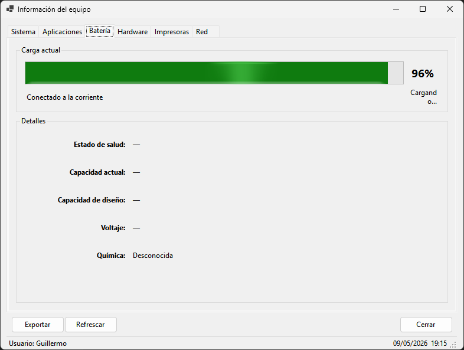
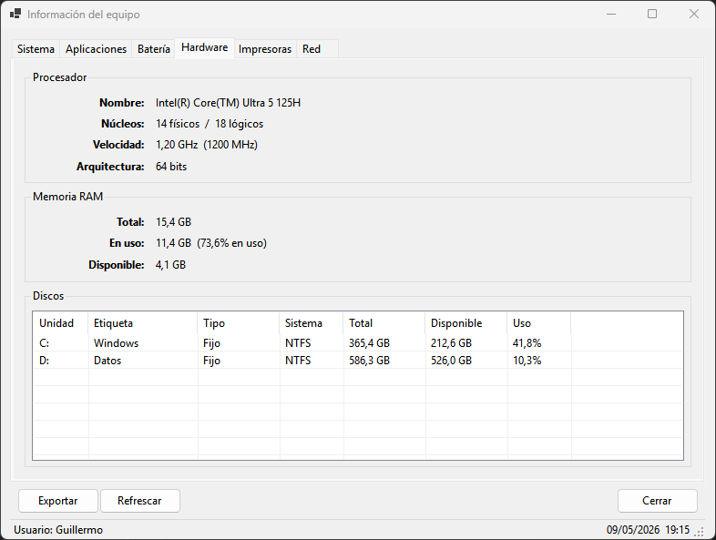
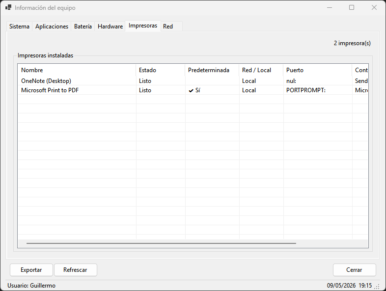
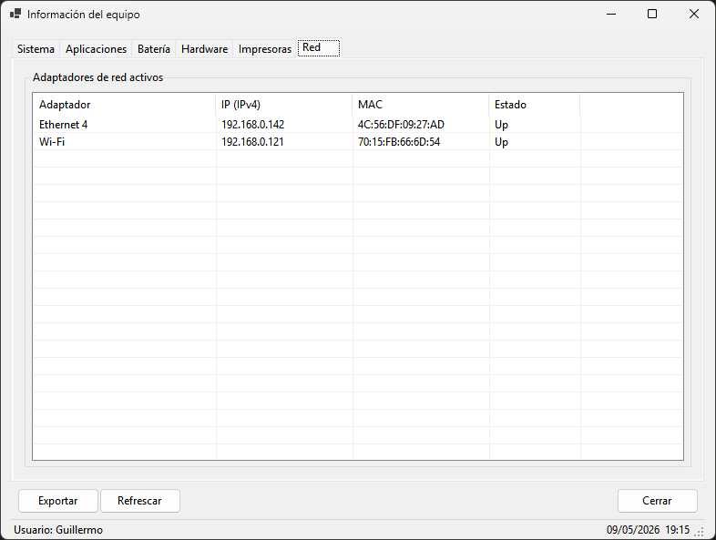

# SysInfoApp


Aplicación de escritorio para Windows desarrollada en .NET 8 con WinForms.
Muestra información detallada del equipo en tiempo real: sistema, hardware,
red, software instalado, impresoras y batería. Diseñada para funcionar sin
permisos de administrador.

---

## Requisitos

| Requisito | Versión |
|---|---|
| Sistema operativo | Windows 10 / 11 |
| .NET SDK | 8.0 o superior |
| Visual Studio Code | Cualquier versión reciente |
| Extensión C# Dev Kit | Microsoft |
| Extensión C# | Microsoft |

---

## Instalación y ejecución

### 1. Restaurar dependencias

```bash
dotnet restore
```

### 2. Ejecutar en modo desarrollo

```bash
dotnet run
```

---

## Para compilar

```bash
dotnet publish -c Release -r win-x64 --self-contained true -p:PublishSingleFile=true -p:IncludeNativeLibrariesForSelfExtract=true
```

## Ruta archivo a publicar

```
bin\Release\net9.0-windows\win-x64\publish
```

> El archivo `.pdb` no es necesario para distribuir la aplicación. Solo se
> necesita el `.exe` generado en la carpeta publish.

---

## Estructura del proyecto

```
SysInfoApp/
├── Program.cs
├── Form1.cs
├── Pages/
│   ├── SystemPage.cs
│   ├── HardwarePage.cs
│   ├── NetworkPage.cs
│   ├── PrintersPage.cs
│   ├── SoftwarePage.cs
│   └── BatteryPage.cs
├── Helpers/
│   ├── WmiHelper.cs
│   └── ExportHelper.cs
└── SysInfoApp.csproj
```

---

## Pestañas

### Sistema



Es la pestaña principal de la aplicación. Muestra un resumen completo de la
identidad del equipo: nombre en la red, fabricante, número de serie, usuario
activo, versión del sistema operativo con número de compilación, tiempo que
lleva encendido el equipo y todas las direcciones IP activas. Si el equipo
está conectado a una red Wi-Fi, muestra el nombre de la red (SSID).

El tiempo de encendido (Uptime) se actualiza automáticamente cada segundo
sin necesidad de hacer clic en Refrescar.

Debajo de la información del equipo aparece una sección de soporte remoto
que muestra en tamaño grande la primera IP válida del equipo, facilitando
el acceso para herramientas de soporte remoto como AnyDesk o Remote Desktop.

| Campo | Descripción |
|---|---|
| Hostname | Nombre del equipo en la red |
| Modelo | Modelo del equipo reportado por el fabricante |
| Serial | Número de serie del BIOS |
| Usuario | Usuario activo en la sesión actual |
| SO | Nombre del sistema operativo y número de build |
| Uptime | Tiempo transcurrido desde el último arranque |
| IP(s) | Direcciones IPv4 activas separadas por coma |
| Wi-Fi (SSID) | Nombre de la red Wi-Fi activa (solo si aplica) |

---

### Aplicaciones



Muestra la lista completa de programas instalados en el equipo, obtenida
directamente del registro de Windows. Lee tanto la rama de 64 bits como la
de 32 bits para garantizar que no quede ninguna aplicación fuera de la lista.
Elimina duplicados automáticamente.

Incluye un buscador en tiempo real que filtra por nombre del programa o por
publicador. El contador en la esquina superior derecha indica cuántos
resultados coinciden con la búsqueda activa.

Se puede ordenar la lista haciendo clic en cualquier encabezado de columna.
Al exportar, si hay un filtro activo, solo se exportan los programas visibles.

| Columna | Descripción |
|---|---|
| Nombre | Nombre del programa instalado |
| Versión | Versión instalada |
| Publicador | Empresa o autor del programa |
| Fecha instalación | Fecha de instalación en formato dd/MM/yyyy |

---

### Bateria *(solo en portátiles)*



Esta pestaña aparece únicamente si el equipo tiene una batería detectada.
En equipos de escritorio no se muestra. Se actualiza automáticamente cada
30 segundos y también al hacer clic en el botón Refrescar.

Muestra dos secciones: la carga actual con una barra de progreso visual y
el porcentaje, y una sección de detalles técnicos con información avanzada
sobre la batería.

El indicador de salud compara la capacidad actual de carga con la capacidad
original de fábrica para determinar el nivel de desgaste de la batería.

| Campo | Descripción |
|---|---|
| Carga actual | Barra de progreso y porcentaje de carga |
| Estado | Conectado a corriente o usando batería |
| Tiempo restante | Estimado de autonomía en horas y minutos |
| Estado de salud | Porcentaje de salud con calificación (Buena, Desgastada, Reemplazar) |
| Capacidad actual | Capacidad máxima de carga actual en mWh |
| Capacidad de diseño | Capacidad original de fábrica en mWh |
| Voltaje | Voltaje nominal en voltios |
| Química | Tipo de batería (Litio-Ion, Litio-Polímero, etc.) |

---

### Hardware



Muestra información técnica detallada sobre los componentes físicos del
equipo, organizada en tres secciones: procesador, memoria RAM y discos.

La sección del procesador muestra datos estáticos que no cambian durante
la sesión. La sección de RAM y la de discos se actualizan al hacer clic
en el botón Refrescar, reflejando el uso actual en ese momento.

**Procesador**

Muestra el modelo completo del CPU, la cantidad de núcleos físicos y lógicos,
la velocidad máxima de operación y la arquitectura del procesador.

| Campo | Descripción |
|---|---|
| Nombre | Modelo completo del procesador |
| Núcleos | Cantidad de núcleos físicos y lógicos |
| Velocidad | Velocidad máxima en GHz y MHz |
| Arquitectura | 32 o 64 bits |

**Memoria RAM**

Muestra el total de memoria instalada, la cantidad en uso con su porcentaje
y la memoria disponible en el momento de la consulta.

| Campo | Descripción |
|---|---|
| Total | Memoria RAM total instalada |
| En uso | Memoria en uso con porcentaje actual |
| Disponible | Memoria libre disponible |

**Discos**

Lista todas las unidades de almacenamiento fijas y extraíbles conectadas
al equipo, con su espacio total, disponible y porcentaje de uso.

| Columna | Descripción |
|---|---|
| Unidad | Letra de la unidad (C:, D:, etc.) |
| Etiqueta | Nombre del volumen |
| Tipo | Fijo o Extraíble |
| Sistema | Sistema de archivos (NTFS, FAT32, exFAT, etc.) |
| Total | Capacidad total de la unidad |
| Disponible | Espacio libre disponible |
| Uso | Porcentaje de espacio utilizado |

---

### Impresoras



Muestra todas las impresoras instaladas en el equipo, incluyendo impresoras
físicas, virtuales (como PDF), de red y locales. Indica cuál es la impresora
predeterminada, su estado actual, el puerto asignado y el controlador (driver)
instalado.

Si la consulta WMI no está disponible, utiliza automáticamente un método
alternativo con las APIs de impresión de .NET que funciona sin restricciones
de permisos, mostrando al menos el nombre y la impresora predeterminada.

Se puede ordenar la lista haciendo clic en cualquier encabezado de columna.
El contador en la esquina superior derecha indica el total de impresoras
encontradas.

| Columna | Descripción |
|---|---|
| Nombre | Nombre de la impresora |
| Estado | Listo, Imprimiendo, Sin conexión, Detenida, etc. |
| Predeterminada | Marca con una tilde si es la impresora por defecto |
| Red / Local | Indica si la impresora es de red o local |
| Puerto | Puerto asignado a la impresora |
| Controlador | Nombre del driver instalado |

---

### Red



Muestra únicamente los adaptadores de red que están activos en el momento
de la consulta. Los adaptadores desconectados o inactivos no aparecen en
la lista para mantener la información relevante y limpia.

Excluye automáticamente las interfaces de loopback (127.0.0.1), las
direcciones APIPA (169.254.x.x) y los adaptadores que no tienen ninguna
IP asignada.

Se actualiza al hacer clic en el botón Refrescar.

| Columna | Descripción |
|---|---|
| Adaptador | Nombre del adaptador de red |
| IP (IPv4) | Dirección IP asignada al adaptador |
| MAC | Dirección física (hardware) del adaptador |
| Estado | Estado operacional del adaptador |

---

## Botones

### Exportar

Genera un archivo en formato Markdown (.md) con toda la información del
equipo organizada en secciones. El archivo se puede abrir en VS Code,
Obsidian, Notion, GitHub o cualquier visor Markdown.

- El nombre del archivo incluye el hostname y la fecha:
  `HOSTNAME_yyyyMMdd_HHmmss.md`
- Se guarda en el escritorio por defecto. La ruta se puede cambiar en el
  diálogo de guardado.
- Si hay un filtro activo en la pestaña Aplicaciones, solo se exportan
  los programas visibles.
- Incluye las secciones: Sistema, Hardware (procesador, RAM, discos),
  Red y Aplicaciones instaladas.

### Refrescar

Actualiza los datos dinámicos de la aplicación sin necesidad de reiniciarla.

| Pestaña | Comportamiento |
|---|---|
| Sistema | El Uptime se actualiza automáticamente cada segundo |
| Hardware | RAM y discos se actualizan al hacer clic |
| Red | La lista de adaptadores se actualiza al hacer clic |
| Impresoras | La lista se actualiza al hacer clic |
| Batería | Se actualiza cada 30 segundos y al hacer clic |
| Aplicaciones | No se refresca (los cambios son poco frecuentes) |

### Cerrar

Cierra la aplicación.

---

## Exportación — estructura del archivo

```
# Información del equipo - HOSTNAME

> Generado: dd/MM/yyyy HH:mm:ss

## Sistema
| Campo | Valor |
...

## Hardware

### Procesador
| Campo | Valor |
...

### Memoria RAM
| Campo | Valor |
...

### Discos
| Unidad | Etiqueta | Tipo | Sistema | Total | Disponible | Uso |
...

## Adaptadores de Red
| Adaptador | IP (IPv4) | MAC | Estado |
...

## Aplicaciones Instaladas
| Nombre | Versión | Publicador | Fecha instalación |
...
Total: N aplicaciones
```

---

## Permisos

La aplicación está diseñada para funcionar sin permisos de administrador.
Cada dato tiene un mecanismo de recuperación en caso de que el método
principal no esté disponible.

| Dato | Método principal | Alternativa |
|---|---|---|
| Serial BIOS | WMI Win32_BIOS | WMI con impersonación, luego wmic CLI |
| Wi-Fi SSID | WMI MSNdis_80211 | netsh wlan show interfaces |
| Impresoras | WMI Win32_Printer | PrinterSettings.InstalledPrinters |
| Batería | SystemInformation.PowerStatus | WMI Win32_Battery |
| Registro software | Registry.LocalMachine | try/catch por clave individual |
| Todo lo demás | APIs públicas de .NET | Sin restricción de permisos |

---

## Dependencias

| Paquete | Versión | Uso |
|---|---|---|
| System.Management | 8.0.0 | Consultas WMI al sistema operativo |

---

## Autor

404q9l - FoxShell
https://github.com/jgohortiz


---------------------

## Para compilar
dotnet publish -c Release -r win-x64 --self-contained true -p:PublishSingleFile=true -p:IncludeNativeLibrariesForSelfExtract=true

## Ruta archivo a publicar
bin\Release\net9.0-windows\win-x64\publish
